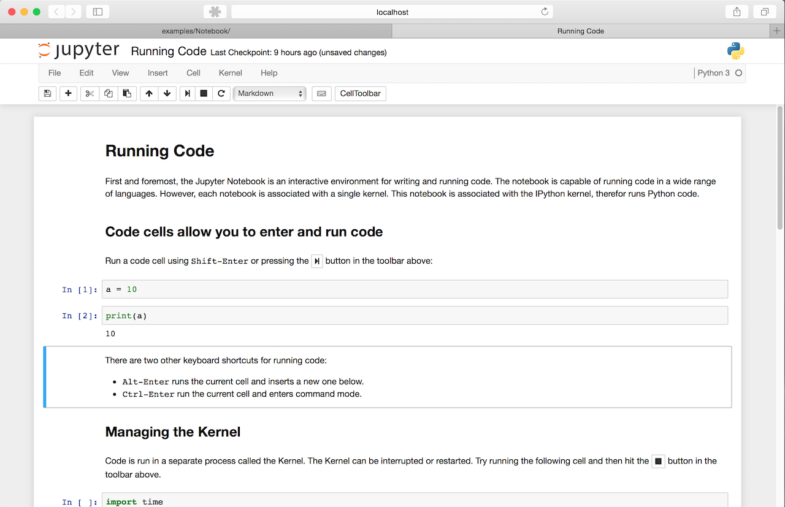

# Jupyter Notebook

                
अंग्रेजी संस्करण लिंक : [[English Version](http://github.com/jupyter/notebook/)]

Jupyter Notebook एक इंटरैक्टिव वेब-आधारित notebook-शैली का वातावरण है।

### Jupyter Notebook, आईपीथॉन notebook का भाषा स्वतंत्र विकास

Jupyter notebook प्रोजेक्ट Jupyter के लिए एक भाषा-स्वतंत्र HTML notebook अनुप्रयोग है।
2015 में, Jupyter notebook को द बिग स्प्लिट ™ के एक भाग के रूप में जारी किया गया था, जो एक आईपीथॉन कोड बेस था। IPython 3 को यूजर लैंग्वेज इंडिपेंडेंट कोड जैसे IPython notebook और विशिष्ट भाषा आधारित कोड जैसे Python के लिए IPython कर्नेल के लिए फीचर के साथ जारी किया गया है।
चूंकि कई भाषाओं की गणना की जाती है, प्रोजेक्ट Jupyter इस रिपॉजिटरी में भाषा-स्वतंत्र ** Jupyter notebook ** विकसित करना जारी रखेगा। फिर, समुदाय की मदद से, अपने स्वयं के भंडार में एक भाषा-विशिष्ट कर्नेल विकसित करें।
[[The Big Split™ announcement](https://blog.jupyter.org/the-big-split-9d7b88a031a7)]
[[Jupyter Ascending blog post](https://blog.jupyter.org/jupyter-ascending-1bf5b362d97e)]

## स्थापना

[Jupyter platform, on ReadTheDocs](https://jupyter.readthedocs.io/en/latest/install.html)आप से इंस्टॉलेशन डॉक्यूमेंट देख सकते हैं।
जुपिटर नोटबुक के उन्नत उपयोग के लिए प्रलेखन [यहाँ](https://jupyter-notebook.readthedocs.io/en/latest/) कृपया देखें।

स्थानीय स्थापना के लिए [pip](https://pip.readthedocs.io/en/stable/installing/) सुनिश्चित करें कि आपने स्थापित किया है, और फिर निम्न कमांड निष्पादित करें।

    $ pip install notebook

## Jupyter Notebook का उपयोग कैसे करें

### स्थानीय स्थापना में निष्पादन

निम्न आदेश चलाएँ:

    $ jupyter notebook

### दूरस्थ स्थापना में निष्पादन

Jupyter Notebook दूरस्थ रूप से लॉन्च करने से पहले कुछ कॉन्फ़िगरेशन की आवश्यकता होती है। [Notebook सर्वर चल रहा है](https://jupyter-notebook.readthedocs.io/en/stable/public_server.html) कृपया देखें।

## विकास की स्थापना

विकास स्थापना कैसे करें, इसकी जानकारी के लिए [`CONTRIBUTING.rst`](https://github.com/jupyter/notebook/blob/master/CONTRIBUTING.rst) कृपया देखें।

## योगदान

यदि आप परियोजना में योगदान करने में रुचि रखते हैं  [`CONTRIBUTING.rst`](https://github.com/jupyter/notebook/blob/master/CONTRIBUTING.rst)कृपया देखें।

## संदर्भ

- [Project Jupyter website](https://jupyter.org)
- [Online Demo at try.jupyter.org](https://try.jupyter.org)
- [Documentation for Jupyter notebook](https://jupyter-notebook.readthedocs.io/en/latest/) [[PDF](https://media.readthedocs.org/pdf/jupyter-notebook/latest/jupyter-notebook.pdf)]
- [Documentation for Project Jupyter](https://jupyter.readthedocs.io/en/latest/index.html) [[PDF](https://media.readthedocs.org/pdf/jupyter/latest/jupyter.pdf)]
- [Issues](https://github.com/jupyter/notebook/issues)
- [Technical support - Jupyter Google Group](https://groups.google.com/forum/#!forum/jupyter)
